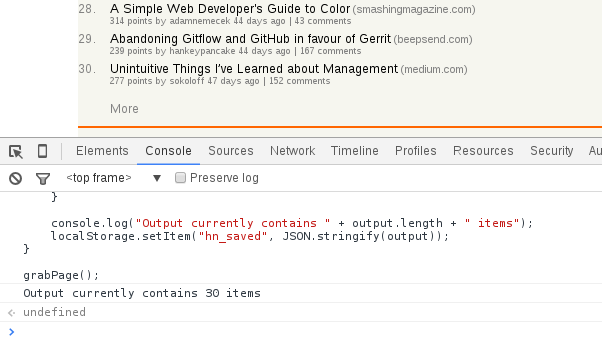
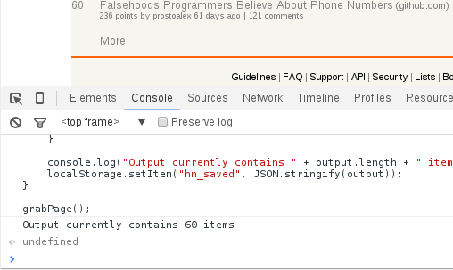
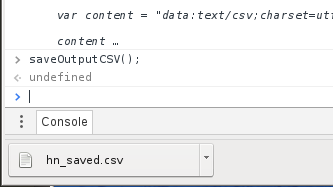
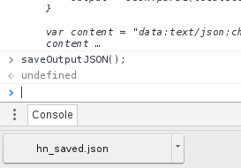

# Hacker News Saved Links Export

Export your Hacker News saved links to JSON or CSV using only the Chrome console. 


1. Navigate to your HN Saved page in Google Chrome and press F12 to open the Developer Tools Console. 

2. Paste the following code into the console and press enter. 

  ```javascript
  var output = new Array();

  grabPage = function() {
      
      if (localStorage.getItem("hn_saved") !== null) {
          output = JSON.parse(localStorage.getItem("hn_saved"));
      }
  
      var table = document.getElementsByClassName("itemlist");
      var trArr = table[0].getElementsByTagName('tr');
  
      for (i = 0; i < Math.floor(trArr.length/3); i++) { 
          link_row = trArr[i*3].getElementsByTagName('td');
          details_row = trArr[i*3 + 1].getElementsByTagName('td');
          
          record_no = link_row[0].getElementsByTagName("span")[0].innerHTML;
          record_no = record_no.replace(/\D/g,'');
  
          title = link_row[2].getElementsByTagName("a")[0].innerHTML;
          page_url = link_row[2].getElementsByTagName("a")[0].href;
  
          comments_url = details_row[1].getElementsByClassName("age")[0].getElementsByTagName("a")[0].href;
          age = details_row[1].getElementsByClassName("age")[0].getElementsByTagName("a")[0].innerHTML;
  
          output[record_no - 1] = {
              "number": record_no, 
              "title": title,
              "page_url": page_url,
              "comments_url": comments_url,
              "age": age
          }
      }
  
      console.log("Output currently contains " + output.length + " items");
      localStorage.setItem("hn_saved", JSON.stringify(output));
  }
  
  grabPage();
  ```
  
  

3. Hit "Next" at the bottom of your saved page. 

4. Paste `grabPage` code into console again. With each page load you'll need to repaste the entire `grabPage` code snippet since nothing is persisted between the loads. To save the data between page loads a local storage item is created with the key `hn_saved`. Each save item is keyed using it's record number so running the code twice on the same page is not an issue. 
  
  
   
  Repeat "Next"/`grabPage` process until all pages are done. 

5. Save the output
   
  - To save output as a CSV, paste the following code. It will automatically download and save as `hn_saved.csv`. 
  
    ```javascript
    saveOutputCSV = function() {
      if (localStorage.getItem("hn_saved") !== null) {
          output = JSON.parse(localStorage.getItem("hn_saved"));
      }
  
      var content = "data:text/csv;charset=utf-8,";
  
      content += "Number,Title,Page URL,Comments URL,Age\n";
  
      for (i = 0; i < output.length; i++) { 
          var row = '';
          var json_row = output[i];
  
          var clean_title = json_row["title"].replace(/"/g, '""');
          clean_title = '"' + clean_title + '"';
  
          row += json_row["number"] + ",";
          row += clean_title + ",";
          row += json_row["page_url"] + ",";
          row += json_row["comments_url"] + ",";
          row += json_row["age"] + "";
          row += "\n";
  
          content += row;
      }
  
      var content_url = encodeURI(content);
      var shadow_link = document.createElement("a");
      shadow_link.setAttribute("href", content_url);
      shadow_link.setAttribute("download", "hn_saved.csv");
  
      shadow_link.click();
    }
    
    saveOutputCSV();
    ```
    
    If successful, the file will automatically download. 
    
    

  - To save output as a JSON, paste the following code. It will automatically download and save as `hn_saved.json`. 
     
    ```javascript
    saveOutputJSON = function() {
      if (localStorage.getItem("hn_saved") !== null) {
          output = JSON.parse(localStorage.getItem("hn_saved"));
      }
  
      var content = "data:text/json;charset=utf-8,";
      content += JSON.stringify(output);
  
      var content_url = encodeURI(content);
      var shadow_link = document.createElement("a");
      shadow_link.setAttribute("href", content_url);
      shadow_link.setAttribute("download", "hn_saved.json");
  
      shadow_link.click();
    }
    
    saveOutputJSON();
    ```
    
    
